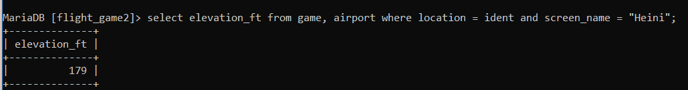
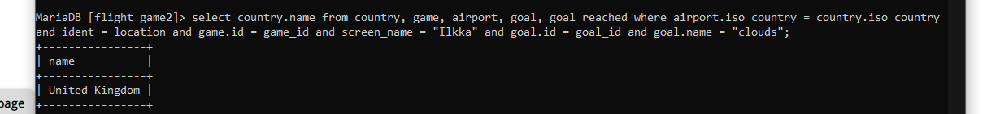

Roberto Caretto 
29.9.2024

# exercise 2
### question 1
 select * from goal !

### question 2
select name,type from airport where iso_country = "FI";

 ### question 3
select name from airport where iso_country = "FI" order by name;

### question 4
select name, type from airport where iso_country = "FI" order by type, name;

### question 5
select name from country where name like "F%";

### question 6
select name from country where name like "%F%";

### question 7
select location from game where screen_name = "Vesa";

### question 8 
select co2_consumed from game where screen_name = "Ilkka";

### question 9
select distinct co2_budget from game;

### question 10
select screen_name, co2_budget, co2_consumed, (co2_budget - co2_consumed) as co2_left from game where screen_name = 'Ilkka';

# exercise 3

### question 1
select country.name as 'country name', airport.name as 'airport name' from country, airport where country.iso_country = airport.iso_country and country.name = 'Iceland';

### question 2
select airport.name as "airport name" from airport where iso_country = "FR" and type = "large_airport";

### question 3
select country.name as "country_name", airport.name as "airport_name" from country, airport where country.iso_country = airport.iso_country and country.continent = "AN";

### question 4 
select elevation_ft from game, airport where location = ident and screen_name = "Heini";

### question 5
select (elevation_ft * 0.3048) as elevation_m from game, airport where location = ident and screen_name = "Heini";

### question 6
select name from airport, game where location = ident and screen_name = "Ilkka"

### question 7 
select country.name from country, game, airport where location = ident and screen_name = "Ilkka" and airport.iso_country = country.iso_country ;

### question 8
select name from goal, goal_reached, game where game.id = game_id and goal.id = goal_id and screen_name = "Heini";

### question 9
select airport.name from airport, game, goal_reached, goal where location = ident and goal.id = goal_id and game.id = game.id and screen_name = "Ilkka" and goal.name = "clouds";

### question 10
select country.name from country, game, airport, goal, goal_reached where airport.iso_country = country.iso_country and ident = location and game.id = game_id and screen_name = "Ilkka" and goal.id = goal_id and goal.name = "clouds";

# exercise 4

### question 1 
select country.name as 'country name', airport.name as 'airport name' from country inner join airport on airport.iso_country = country.iso_country where country.name = 'finland' and scheduled_service = 'yes';

### question 2
select screen_name, airport.name from game, airport where location = ident;

### question 3
select screen_name, country.name from game inner join airport on location = ident inner join country on country.iso_country = airport.iso_country;

### question 4
select airport.name, screen_name from airport left join game on location = ident where name like "%Hels%";

### question 5
select name, screen_name from goal left join goal_reached on goal.id = goal_id left join game on game.id = game_id;

# exercise 5

### question 1
select name from country where iso_country in (select iso_country from airport where name like "Satsuma%");

### question 2
select airport.name from airport, country where country.iso_country = airport.iso_country and country.name = "Monaco";

### question 3
select screen_name from game where id in (select game_id from goal_reached where goal_id in (select id from goal where name = "Clouds"));

### question 4
select name from country where iso_country not in (select iso_country from airport);

### question 5
select name from goal where id not in (select goal.id from goal, goal_reached, game where game.id = game_id and goal.id = goal_id and screen_name = "Heini");

# exercise 6

### question 1
select max(elevation_ft) from airport

### question 2
select distinct continent, count(*) from country group by continent; 

### question 3
select distinct screen_name, count(*) from game, goal_reached where id = game_id group by scr

### question 4
select screen_name from game where co2_consumed in (select min(co2_consumed) from game);

### question 5
 select country.name, count(*) from country, airport where airport.iso_country = country.iso_country group by country.iso_country order by count(*) desc limit 50;
 
 
### question 6
select country.name from country, airport where country.iso_country = airport.iso_country group by country.iso_country having count(*) > 1000;

### question 7
select name from airport where name in (select max(elevation_ft) from airport);

### question 8
select country.name from country, airport where country.iso_country = airport.iso_country and airport.name in (select max(elevation_ft) from airport);

### question 9
select count(*) from game, goal_reached where id = game_id and screen_name = "Vesa" ;

### question 10
select name from airport where latitude_deg in (select min(latitude_deg) from airport);

# exercise 7

### question 1
update game set location = (select ident from airport, country where country.iso_country = airport.iso_country and airport.name = "Nottingham Airport"), co2_consumed = co2_consumed + 500 where screen_name = "Vesa";

### question 2
choice b

### question 3
delete from goal_reached;

### question 4
delete from game;

